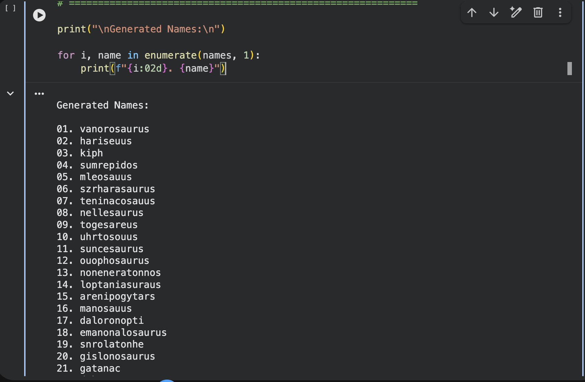
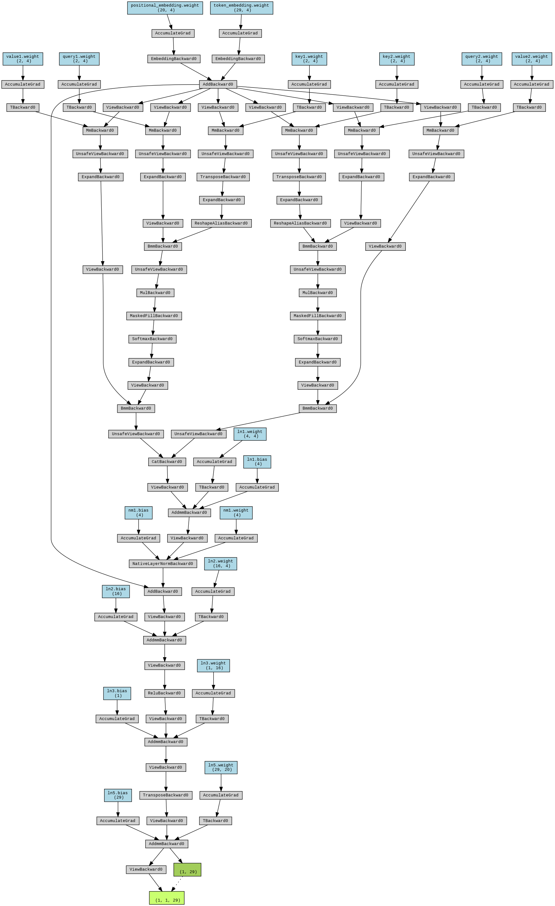

# Transformer-decoder-char-generator
This is a toy dinosaur name generator model. It is a character-level transformer-decoder based architecture.

The goal is to generate a realistic sounding dinosaur name using transformer's decoder model.

## Example Names:
This are some of the real names of dinosaurs. It can be found in the dinosaurs.csv file inside assets. 

Example:
  1. agujaceratops
  2. charonosaurus
  3. gracilisuchus
  4. inosaurus

## Result generated:
 The names generated after 10 epoch is in the image below. Feel free to train more than 10 epoch to get more interesting results. But, after 10 epochs, the model seems to make sense well enough. 

 <p align="center">
  
</p>

## Tokens:
Since it is a character level model. The tokens are simply the alphabet + the start and the end token as shown below. 
```text
['<start>', 'a', 'b', 'c', 'd', 'e', 'f', 'g',
 'h', 'i', 'j', 'k', 'l', 'm', 'n', 'o', 'p',
 'q', 'r', 's', 't', 'u', 'v', 'w', 'x', 'y',
 'z', '<end>']
```

## Model architecture
 <p align="center">
  
</p>

